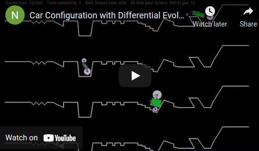

# evolutionaryCarRace
Built with PyMunk and PyGame, this program showcases the concept of Differential Evolution using cars that explore the search space of various configurations of speed, chassis size and wheel radius, to eventually exploit the search space and locate the optimal or near-optimal solution.

The cars learn from each other's configurations. The program can perform better if there is a population size (number of cars) that is approximately 30.
  
Install PyMunk using: `pip install pymunk==6.2.1`  
Install PyGame using: `pip install pygame==2.1.2`  
This program used Python 3.9.6.  
